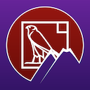

RVS_ONVIF
=
This project is a low-level [ONVIF](https://onvif.org) "driver" for Cocoa (Apple's [MacOS](https://www.apple.com/macos), [iOS](https://www.apple.com/ios) and [tvOS](https://www.apple.com/tvos)).

DEPENDENCIES
=
BUILD DEPENDENCIES
-
For testing, we depend upon [SWXMLHash](https://github.com/drmohundro/SWXMLHash), written by [David Mohundro](https://mohundro.com/) to parse mock XML data.
**NOTE:** For whatever reason, the CocoaPods project sets the Swift version of the SWXMLHash project to 3.0. Set it to 5. It will work.
For code LINTing, we use [SwiftLint](https://github.com/realm/SwiftLint), written by the fine folks at [Realm.io](https://realm.io/).
For video display in our test harneses, we depend on variations of [VLCKit](https://code.videolan.org/videolan/VLCKit), written and maintained by the team at [VideoLAN](https://www.videolan.org/).

NOTE ABOUT TESTING:
-
We directly include the unit tests, as opposed to building the modules, because we are using completely generic tests, applied to all three platforms, so we don't want to deal with any conditional import weirdness.

RUNTIME DEPENDENCIES
-
We use [SOAPEngine](https://github.com/priore/SOAPEngine) written and maintained by [the Priore Group](https://www.prioregroup.com) for dealing with the low-level SOAP wrapper. If you want to use this on devices, then you must [obtain a license for SOAPEngine](https://github.com/priore/SOAPEngine/blob/master/README.md#licenses) from Priore Group.
